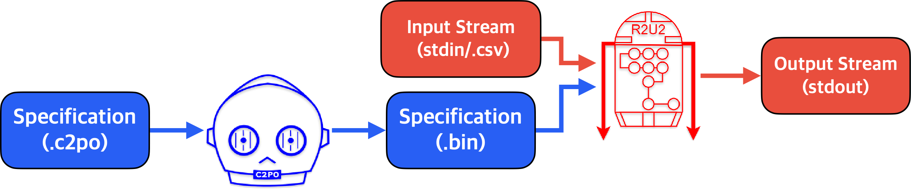

# About

The Realizable, Reconfigurable, Unobtrusive Unit (R2U2) is a stream-based runtime verification
framework based on Mission-time Linear Temporal Logic (MLTL) designed to monitor safety- or
mission-critical systems with constrained computational resources.

Given a specification and input stream, R2U2 will output a stream of verdicts computing whether the
specification with respect to the input stream. Specifications can be written and compiled using the
Configuration Compiler for Property Organization (C2PO).



If you would like to cite R2U2, please use our [2023 CAV paper](https://link.springer.com/chapter/10.1007/978-3-031-37709-9_23) ([.bib](CITATION.bib)). 

# Requirements 

The following dependencies are required to run R2U2 and C2PO: 
- Make 
- C99 compiler 
- Python 3.8 or greater

# Building

To build R2U2, run `make` from `monitors/c/`:
```bash
cd monitors/c/
make
```

# Running

Running R2U2 requires a **specification** and an **input stream**. To monitor the specification
defined in [`examples/simple.c2po`](examples/simple.c2po) using
[`examples/simple.csv`](examples/simple.csv) as an input stream:

1. Compile the specification using C2PO
```bash
python3 compiler/c2po.py --output spec.bin --map examples/simple.map examples/simple.c2po 
```

2. Run R2U2 using the compiled specification and the input stream
```bash
./monitors/c/build/r2u2 spec.bin < examples/simple.csv
```

## Output

The output of R2U2 is a *verdict stream* with one verdict per line. A verdict includes a **formula
ID**, **timestamp**, and **truth value**. Formula IDs are determined by the order in which they are
defined in the specification file.  Verdicts are *aggregated* so that if R2U2 can determine a range
of values with the same truth at once, only the last time is output.

The following is a stream where formula 0 is true from 0-7 and false from 8-11 and formula 1 is
false from times 0-4:

```
0:7,T
1:4,F
0:11,F
```

# Examples

Example specifications and traces can be found in the [`examples/`](examples/), [`test/`](test/),
and  [`compiler/test/`](compiler/test/) directories.

The [`benchmarks/`](benchmarks/) directory includes sets of larger specifications taken from various
sources. See each sub-directory's README for its description and source.

# Support 

If you believe you have found a case of unsound output from R2U2, please refer to
[CONTRIBUTING.md](CONTRIBUTING.md) and open a bug report issue.

## License

Licensed under either of

* Apache License, Version 2.0, ([LICENSE-APACHE](LICENSE-APACHE) or http://www.apache.org/licenses/LICENSE-2.0)
* MIT license ([LICENSE-MIT](LICENSE-MIT) or http://opensource.org/licenses/MIT)

at your option.

Unless you explicitly state otherwise, any contribution intentionally submitted for inclusion in the
work by you, as defined in the Apache-2.0 license, shall be dual licensed as above, without any
additional terms or conditions.
