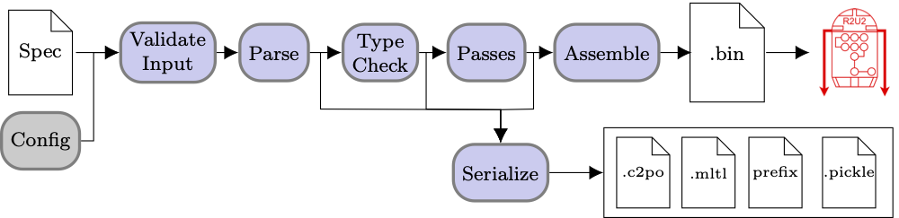

# Internal Architecture

C2PO has a fairly standard compiler architecture -- parses input into an abstract syntax tree we
call the C2PO Parse Tree (CPT), type checks the CPT, performs various passes on the CPT
(simplification, optimizations), then outputs an assembly program that represents the original
input.

## Passes

The pass pipeline is defined in [passes.py](../c2po/passes.py) in the variable `PASS_LIST`. We
remove passes as necessary in the function `validate_input` in [main.py](../c2po/main.py).

1. Expand out all definitions from the `DEFINE` block
2. Change all valid "function calls" to struct instantiations
3. Replace assume-guarantee contracts with a three formula encoding
4. Expand out all set aggregation operators
5. Change each struct access to its referenced data
6. Change each array index to its referenced data
7. Change each struct access to its referenced data again (in the case that a struct is an element
   of an array and an array is a member of a struct)
8. Compute which nodes in the CPT are interfaces between the BZ/AT engines and the TL engine
9. Perform single-pass of rewrite rules
10. Perform equality saturation
11. Rewrite to negative normal form
12. Rewrite to Boolean normal form
13. Rewrite extended operators
14. Convert all multi-arity operators to binary (ex: `&&`)
15. Perform common sub-expression elimination
16. Check satisfiability of each specification
17. Compute the sizes of each node's DUOQ

## Serialization

After any stage of the compilation (i.e., parsing, type checking, any pass), the current state of
the CPT can be serialized into C2PO format, MLTL-STD, C2PO with prefix notation, or pickled. These
formats can be produced with the functions `to_infix_str`, `to_prefix_str`, or `to_mltl_std` over
any CPT node (defined in [cpt.py](../c2po/cpt.py)). Any CPT node can be pickled using the
`pickle.dump` function from the `pickle` module.