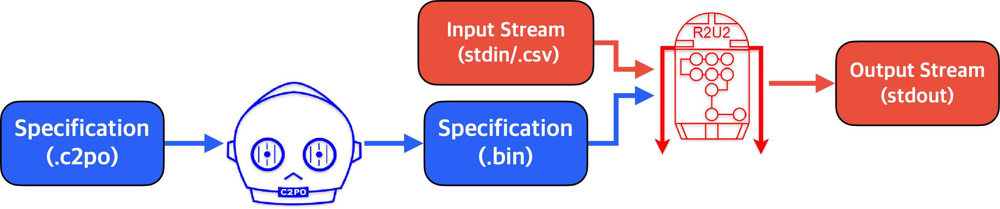

# R2U2 Command Line Interface

The Realizable, Reconfigurable, Unobtrusive Unit (R2U2) is a stream-based runtime verification
framework based on Mission-time Linear Temporal Logic (MLTL) designed to monitor safety- or
mission-critical systems with constrained computational resources.

Given a specification and input stream, R2U2 will output a stream of verdicts computing whether the
specification with respect to the input stream. Specifications can be written and compiled using the
Configuration Compiler for Property Organization (C2PO).



This crate allows specifications to be compiled with C2PO and monitored with R2U2. For detailed usage try:

    r2u2_cli --help

# Requirements

To enable satisfiability checking, install [Z3](https://github.com/Z3Prover/z3). On debian-based
systems, this can be done via `sudo apt-get install z3`.

# Example Usage

Given the following example.c2po file:
   
    INPUT
        a,b: bool;

    FTSPEC
        F[1,2] (a && b);

and the following example.csv file:

    # a,b
    0,0
    1,0
    0,1
    1,1
    0,0
    1,0
    0,1
    1,1

the following command will create a spec.bin file in the current directory:

    r2u2_cli compile example.c2po example.csv

and the following command:

    r2u2_cli run spec.bin example.csv

will output the following to the console:

    0:0,F
    0:2,T
    0:3,F
    0:4,F
    0:6,T

The single following command will also provide the same output:
    
    r2u2_cli run example.c2po example.csv

For all available options, try `r2u2_cli compile --help` and `r2u2_cli run --help`.

## Output

The output of R2U2 is a *verdict stream* with one verdict per line. A verdict includes a **formula
ID**, **timestamp**, and **truth value**. Formula IDs are determined by the order in which they are
defined in the specification file.  Verdicts are *aggregated* so that if R2U2 can determine a range
of values with the same truth at once, only the last time is output.

The following is a stream where formula 0 is true from 0-7 and false from 8-11 and formula 1 is
false from times 0-4:

```
0:7,T
1:4,F
0:11,F
```

# Examples Specifications and Traces

Example specifications and traces can be found on our [github page](https://github.com/R2U2/r2u2/tree/rust-develop).

# Documentation

The documentation for R2U2 can be found [here](https://r2u2.github.io/r2u2/). The documentation includes user and developer guides for both R2U2 and C2PO.

## License

Licensed under either of

* Apache License, Version 2.0, ([LICENSE-APACHE](LICENSE-APACHE) or http://www.apache.org/licenses/LICENSE-2.0)
* MIT license ([LICENSE-MIT](LICENSE-MIT) or http://opensource.org/licenses/MIT)

at your option.

Unless you explicitly state otherwise, any contribution intentionally submitted for inclusion in the
work by you, as defined in the Apache-2.0 license, shall be dual licensed as above, without any
additional terms or conditions.