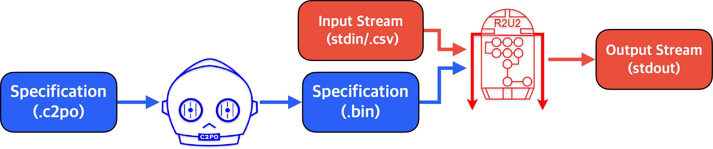

# About

The Realizable, Reconfigurable, Unobtrusive Unit (R2U2) is a stream-based runtime verification
framework based on Mission-time Linear Temporal Logic (MLTL) designed to monitor safety- or
mission-critical systems with constrained computational resources.

Given a specification and input stream, R2U2 will output a stream of verdicts computing whether the
specification with respect to the input stream. Specifications can be written and compiled using the
Configuration Compiler for Property Organization (C2PO).



# Installation

Add this to your `Cargo.toml`:

```toml
[dependencies]
r2u2_core = "0.1.0"
```

# Example Usage

1. git clone -b rust-develop https://github.com/R2U2/r2u2.git
2. cd r2u2
3. Running R2U2 requires a **specification** and an **input stream**. To monitor the specification
defined in [`examples/simple.c2po`](https://github.com/R2U2/r2u2/blob/rust-develop/examples/simple.c2po) using
[`examples/simple.csv`](https://github.com/R2U2/r2u2/blob/rust-develop/examples/simple.csv) as an input stream, compile the specification using C2PO:

    ```bash
    python3 compiler/c2po.py --output spec.bin --map examples/simple.map examples/simple.c2po 
    ```
4. Create a Cargo package with R2U2 as a dependency and run as follows in main.rs

        ```
        let spec_file: Vec<u8> = fs::read(spec.bin).expect("Error opening specification file");

        let mut monitor = r2u2_core::get_monitor(&spec_file);

        let mut signal_file: fs::File = fs::File::open("examples/simple.csv").expect("Error opening signal CSV file");
        let mut reader = csv::ReaderBuilder::new().trim(csv::Trim::All).has_headers(true).from_reader(signal_file);

        for result in reader.records() {
            let record = &result.expect("Error reading signal values");
            for n in 0..record.len(){
                r2u2_core::load_string_signal(&mut monitor, n, record.get(n).expect("Error reading signal values"));
            }
            if r2u2_core::monitor_step(&mut monitor) {
                for out in r2u2_core::get_output_buffer(&mut monitor).iter() {
                    println!("{}:{},{}", out.spec_num, out.verdict.time, if out.verdict.truth {"T"} else {"F"} );
                }
            } else {
                println!("Overflow occurred!!!!")
            }
        }
        ```

## Output

The output of R2U2 is a *verdict stream* with one verdict per line. A verdict includes a **formula
ID**, **timestamp**, and **truth value**. Formula IDs are determined by the order in which they are
defined in the specification file.  Verdicts are *aggregated* so that if R2U2 can determine a range
of values with the same truth at once, only the last time is output.

The following is a stream where formula 0 is true from 0-7 and false from 8-11 and formula 1 is
false from times 0-4:

```
0:7,T
1:4,F
0:11,F
```

# Examples Specifications and Traces

Example specifications and traces can be found on our [github page](https://github.com/R2U2/r2u2/tree/rust-develop).

# Documentation

The documentation for R2U2 can be found [here](https://r2u2.github.io/r2u2/). The documentation includes user and developer guides for both R2U2 and C2PO.

## License

Licensed under either of

* Apache License, Version 2.0, ([LICENSE-APACHE](LICENSE-APACHE) or http://www.apache.org/licenses/LICENSE-2.0)
* MIT license ([LICENSE-MIT](LICENSE-MIT) or http://opensource.org/licenses/MIT)

at your option.

Unless you explicitly state otherwise, any contribution intentionally submitted for inclusion in the
work by you, as defined in the Apache-2.0 license, shall be dual licensed as above, without any
additional terms or conditions.